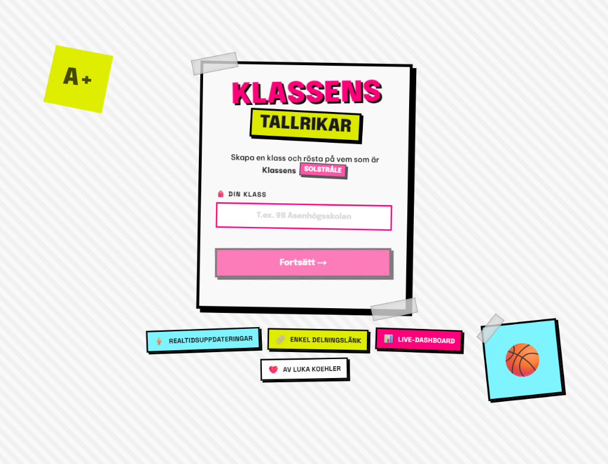

# Klassens Tallrikar

A full-stack web application built for schools and classes to easily organize, manage, and vote on class superlatives/awards (e.g., "Class Clown", "Most Likely to Succeed").

## Features

- **Class Creation**: Create a dedicated workspace for your class with a unique URL (`/klass/[slug]`) and an admin password.
- **Admin Management**: Easily add students, define award categories, and manage nicknames.
- **Interactive Voting**: A smooth, step-by-step voting interface for students with progress tracking.
- **Real-time Dashboard**: An admin dashboard featuring pie charts to visualize voting results in real time.

## Tech Stack

- **Framework**: [Next.js](https://nextjs.org/) (App Router)
- **Language**: [TypeScript](https://www.typescriptlang.org/)
- **Styling**: [Tailwind CSS](https://tailwindcss.com/)
- **Backend & Database**: [Convex](https://www.convex.dev/)
- **Animations & Charts**: [Framer Motion](https://www.framer.com/motion/) (Custom SVG charts)
- **Analytics & Performance**: [Vercel Analytics & Speed Insights](https://vercel.com/analytics)

## Project Structure

- `convex/`: Backend logic, database schema (`schema.ts`), and CRUD mutations/queries for classes, students, awards, and votes.
- `src/app/`: Next.js frontend pages and routing.
    - `klass/[slug]/`: Main class hub.
    - `klass/[slug]/rosta/`: The student voting interface.
    - `klass/[slug]/dashboard/`: Admin results dashboard.
- `src/components/`: Reusable React components (e.g., `VotePieChart`, `ProgressBar`, `CreateClassForm`).
- `src/lib/`: Utility functions.

## Getting Started

### Prerequisites

Make sure you have [Node.js](https://nodejs.org/) installed.

### Installation

1. Clone the repository and install dependencies:
   `ash
   npm install
   `

2. Start the Convex backend (this will prompt you to log in and set up a Convex project):
   `ash
   npx convex dev
   `

3. In a separate terminal, start the Next.js development server:
   `ash
   npm run dev
   `

4. Open [http://localhost:3000](http://localhost:3000) in your browser to see the application.
